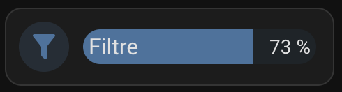

# hass-bar-card - Custom Bar Card for Home Assistant 🎨



This custom version of the **Bar Card** for Home Assistant allows you to display a simple percentage bar that is quick and easy to integrate into your Lovelace cards. It blends seamlessly with the "Tile" look & feel of the latest Home Assistant versions. This card is based on custom CSS and leverages existing code to fine-tune the appearance.

## 🚀 Features
- Displays a percentage progress bar.
- Seamlessly integrates with the "Tile" look & feel of recent Home Assistant versions.
- Easily customizable using `card_mod` and `bar-card`.
- Adjust size, colors, and styles via custom CSS.

## ⚙️ Prerequisites

Before you can use this card, make sure you have the following integrations installed:

1. **Bar Card**  
   Install the `bar-card` through [HACS](https://hacs.xyz/) or [manually](https://github.com/custom-cards/bar-card).

2. **Card Mod**  
   Install the `card_mod` through [HACS](https://hacs.xyz/) or [manually](https://github.com/thomasloven/lovelace-card-mod).

## 📝 Usage

Here’s our example of how to use the Custom Bar Card with custom styles. This configuration creates a progress bar with a customized style, a filter icon, and a custom name.

```yaml
type: custom:bar-card
entities:
  - entity: sensor.eversweet_solo_2_filter
    name: Filtration
    color: rgb(68, 115, 158)
    height: 25px
    positions:
      indicator: "off"
card_mod:
  style: >
    .card-content {
      position: relative;
      top: 50%;
      transform: translateY(-50%);
    }

    bar-card-currentbar, bar-card-backgroundbar {
      border-radius: 15px;
    }

    #states > bar-card-row > bar-card-card > bar-card-indicator {
      width:10px;
    }


    #states > bar-card-row > bar-card-card > bar-card-background {
      // background-color:red;
      position: relative;
      height: 25px;
      top: 50%;
      left: -5px;
      transform: translateY(-50%);
    }

    #states > bar-card-row > bar-card-card > bar-card-background >
    bar-card-contentbar > bar-card-name {
      font-size: 16px;
    }

    bar-card-row {
      padding: 0px;
    }

    #states {
      padding-left: 7px;
      padding-right: 7px;
    }

    bar-card-row ha-icon {
      color: var(--state-icon-color);
    }

    bar-card-row ha-icon::before {
      content: ''; /* Nécessaire pour ajouter une "bulle" */
      position: absolute;
      top: 0;
      left: 0;
      right: 0;
      bottom: 0;
      margin: auto;
      width: 90%; /* Ajuste la taille du remplissage */
      height: 90%;
      background-color: var(--state-icon-color); /* Couleur et transparence du fond */
      opacity: 0.2;
      border-radius: 50%; /* Garder rond */
      z-index: -1; /* Place derrière l'icône */
    }
```

## 🛠️ Customization

You can customize the color of the progress bar and keep the same look&fell using the following options:
- `entity`: The Home Assistant entity (required).
- `name`: The name displayed on the bar (optional).
- `color`: The color of the progress bar (optional, CSS format, e.g., green, rgb(68, 115, 158), #FF5733).
- `icon`: The icon associated with the entity (optional).
- Icon color and the circular background color are customizable via CSS variables (var(--state-icon-color) by default).

## 🖌️ CSS Functionality

The card relies on Card Mod to apply custom styles via CSS. Here are the main customizations you can adjust:

- `bar-card-currentbar` and `bar-card-backgroundbar`: For adjusting the border, color, or appearance of the progress bar.
- `bar-card-indicator`: Used to define the width of the progress indicator (e.g., the arrow indicating the progress).
- `bar-card-name`: To adjust the size and appearance of the text displayed above or next to the bar.
- `ha-icon`: Adds a visual effect like a bubble around the entity's icon.

You can adjust these styles to give each progress bar a unique look.

